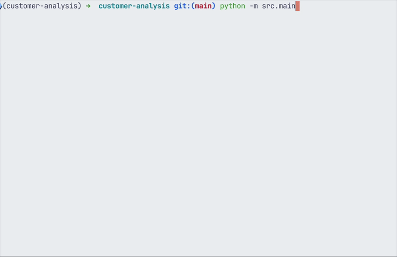

# Conversational AI Agent with Graph-Based Recommendations

This project implements an intelligent conversational agent for a banking/insurance setting. The agent uses a combination of graph-based data analysis and a large language model (LLM) to provide context-aware, empathetic, and relevant responses to customer queries.



## Key Features

- **Graph-Based Knowledge:** The system builds knowledge graphs from conversation data to understand relationships between products, customer preferences, and emotions.
- **Real-time Emotion Detection:** It analyzes customer messages in real-time to detect their emotional state (e.g., confused, anxious, positive).
- **Dynamic Recommendations:** Based on the conversation context and detected emotion, the system provides internal recommendations to the AI agent, guiding it on what topics to discuss next.
- **AI-Powered Dialogue:** It uses Google's Gemini model via LangChain to generate natural and intelligent agent responses that are informed by the system's analysis.
- **Persistent Models:** The knowledge graphs are built once and saved to disk, allowing for fast startup on subsequent runs.

## How It Works

1.  **Graph Building:** On the first run, the system processes a CSV of conversation logs (`conversations-1750493143.csv`) to build two key knowledge graphs:
    - A **Holistic Concept Graph** linking products, preferences, and emotions.
    - An **Emotion-Word Graph** that serves as a data-driven emotion lexicon.
      These graphs are saved as `.gpickle` files.
2.  **Interactive Chat:** When the main script is run, it loads the pre-built graphs and starts an interactive chat loop.
3.  **Inference Loop:** For each customer message, the system:
    - Detects the customer's emotion.
    - Extracts key concepts (products, preferences).
    - Updates the conversation context.
    - Generates new topic recommendations.
    - Feeds the context and recommendations to the AI agent to generate a reply.

## Setup

### Prerequisites

- Python 3.12
- An environment variable named `GOOGLE_API_KEY` containing your API key for Google's Generative AI services.

### Installation

1.  **Clone the repository:**

    ```bash
    git clone https://github.com/espisangijo/customer-analysis.git
    cd customer-analysis
    ```

2.  **Install the required packages:**
    It is recommended to use a virtual environment.
    ```bash
    pip install -r requirements.txt
    ```

## Running the Application

To start the interactive chat session, run the main script from the root directory of the project:

```bash
python src/main.py
```
